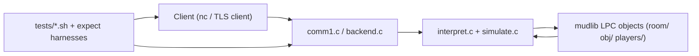

# LPmud Driver Quickstart (parse)

This document is for architects and maintainers working on the C driver (`parse`) rather than mudlib gameplay code.

---

## 1) System Boundaries

- **Driver**: `parse` binary built from top-level C sources.
- **Mudlib**: LPC content and persistent game data under `mudlib/`.
- **Runtime contract**: the driver evaluates LPC, manages objects/heartbeats/call_out/network I/O, and delegates policy to mudlib (`valid_read`, `valid_write`, wizard levels, commands).

Primary startup sequence:

1. `main.c` initializes runtime state and enters `backend()`.
2. `backend.c` loads initial objects from `mudlib/room/init_file`, starts IPC/listener, then enters command/heartbeat loop.
3. `interpret.c` evaluates LPC bytecode/AST structures (`lnode`).
4. `simulate.c` provides efun implementations and core object behaviors.

High-level data/control flow:

Reference files:

- [`README`](README)
- [`main.c`](main.c)
- [`backend.c`](backend.c)
- [`interpret.c`](interpret.c)
- [`simulate.c`](simulate.c)
- [`object.c`](object.c)

---

## 2) Core Runtime Subsystems

### Object model and lifecycle

- `object.c` owns object allocation, refcounting, free paths, and save/restore hooks.
- `simulate.c` handles object loading (`load_object`), lookup, movement, command dispatch, and many efuns.
- Object source files are LPC `.c` under mudlib; driver may produce `.i` preprocessed artifacts during compile flow.

Key files:

- [`object.c`](object.c)
- [`simulate.c`](simulate.c)
- [`swap.c`](swap.c)

### Evaluation engine

- `interpret.c` executes parsed `lnode` structures and implements many built-in operations.
- `lang.y` + `lexical.l` produce parser/lexer used by object compilation.

Key files:

- [`interpret.c`](interpret.c)
- [`lang.y`](lang.y)
- [`lexical.l`](lexical.l)
- [`lnode.h`](lnode.h)

### Scheduler and timing

- **Heartbeats/resets**: `backend.c` (`call_heart_beat`, `move_current_reset`).
- **Deferred calls**: `call_out.c`.

Key files:

- [`backend.c`](backend.c)
- [`call_out.c`](call_out.c)

### Networking and command ingress

- `comm1.c` handles sockets, input buffering, and player command extraction.
- `backend.c` routes command lines to `ed`, `input_to`, or normal parser flow.

Key files:

- [`comm1.c`](comm1.c)
- [`comm.h`](comm.h)
- [`backend.c`](backend.c)

Runtime networking environment variables:

- `MUD_BIND_ADDR`: listener bind target (`127.0.0.1` default, `*`/`0.0.0.0` for all interfaces).
- `MUD_SSL`: optional TLS toggle (`0`/unset = plain TCP, non-zero = TLS mode).
- `MUD_SSL_CERT_FILE`: PEM certificate path (required when `MUD_SSL` is enabled).
- `MUD_SSL_KEY_FILE`: PEM private key path (required when `MUD_SSL` is enabled).
- `MUD_SSL_CA_FILE`: PEM CA bundle used for optional client certificate verification.
- `MUD_SSL_VERIFY_CLIENT`: enable client cert validation when set to a truthy value; requires `MUD_SSL_CA_FILE`.

### Persistence

- Driver-level persistence interfaces:
  - `save_object` / `restore_object` in `object.c`.
  - file I/O efuns and path mediation in `simulate.c` + `backend.c`.
- Wizard score file `WIZLIST` managed by `wiz_list.c`.

Key files:

- [`object.c`](object.c)
- [`backend.c`](backend.c)
- [`simulate.c`](simulate.c)
- [`wiz_list.c`](wiz_list.c)

---

## 3) Security/Policy Model

- Driver enforces technical guards (path legality checks, privilege checks for select efuns, memory boundaries).
- Mudlib remains the policy authority for file access and many permissions (`valid_read`, `valid_write`, command-level checks).

Reference:

- [`SECURITY.md`](SECURITY.md)
- [`simulate.c`](simulate.c)
- [`mudlib/obj/player.c`](mudlib/obj/player.c)

---

## 4) Build, Validation, and Artifacts

Build:

- `make parse`
- `make count_active` (optional utility)

Validation gates:

- `make ci-warnings` (strict warnings)
- `make ci-sanitize` (ASAN/UBSAN)
- `make ci-analyze` (clang static analysis)
- `make ci-tidy` (calibrated clang-tidy checks; standalone, not part of `make ci`)

Reference:

- [`Makefile`](Makefile)

---

## 5) Architecture Risks to Keep in Mind

- Legacy C patterns: fixed-size stack buffers, ad-hoc string handling, nontrivial refcount paths.
- Tight coupling between driver internals and mudlib assumptions.
- Runtime state and persistent mudlib files are mutable and often tracked in this repo; be explicit about operational vs source changes.

---

## 6) Recommended Maintenance Workflow

1. Reproduce with `parse` + minimal mudlib scenario.
2. Patch with smallest possible behavioral delta.
3. Run CI compile/analyze gates (`ci-warnings`, `ci-sanitize`, `ci-analyze`) plus `ci-tidy`.
4. Smoke test command flow, object loading, resets/heartbeats, and persistence.
5. Update `SECURITY.md` when fixing security-relevant defects.
